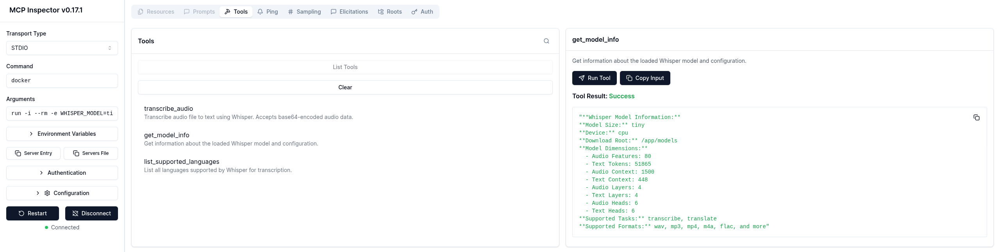

# Whisper API server
This repository provides simple HTTP API for [OpenAI Whisper](https://github.com/openai/whisper) (general-purpose speech recognition model) with MCP (Model Context Protocol) support.

## Prepare
- Virtual environment
```bash
python -m venv .venv
source .venv/bin/activate
uv sync
```

## Environment variables

**VARIABLE**            | **DESCRIPTION**                                                                | **TYPE** | **DEFAULT**
------------------------|--------------------------------------------------------------------------------|----------|-----------------
WHISPER_MODEL           | One of the Whisper models (`tiny`, `base`, `small`, `medium`, `large-v3`, ...) | string   | `tiny`
WHISPER_DEVICE          | Whisper device CPU (`cpu`) / GPU (`cuda`)                                      | string   | `cuda`
WHISPER_DOWNLOAD_FOLDER | Folder for downloaded models (mount as volume for persistence)                 | string   | `/home/alma/LLM`

## Pre-downloading Models

To avoid downloading models every time a container starts, pre-download them to a host directory:

```bash
# Create models directory
mkdir -p /home/alma/LLM

# Pre-download models using Python
python -c "import whisper; whisper.load_model('tiny', download_root='/home/alma/LLM')"
python -c "import whisper; whisper.load_model('base', download_root='/home/alma/LLM')"
python -c "import whisper; whisper.load_model('small', download_root='/home/alma/LLM')"
```

## Running

### HTTP API Server

```bash
WHISPER_MODEL=tiny WHISPER_DEVICE=cuda WHISPER_DOWNLOAD_FOLDER=/home/alma/LLM uv run uvicorn main:app --host 0.0.0.0 --port 8000
```

### MCP Server

Run as an MCP (Model Context Protocol) server for integration with MCP-compatible clients:

#### Option 1: Local Python
```bash
source .venv/bin/activate
WHISPER_MODEL=tiny WHISPER_DEVICE=cuda WHISPER_DOWNLOAD_FOLDER=/home/alma/LLM python run_mcp_server.py
```

#### Option 2: Docker (Recommended)
```bash
# Using the convenience script
./run_mcp_docker.sh tiny cpu

# Or manually with docker
docker build -f Dockerfile.mcp -t whisper-mcp .
docker run -i --rm -e WHISPER_MODEL=tiny -e WHISPER_DEVICE=cpu whisper-mcp
```

**Note:** The Docker image pre-downloads the `tiny` model during build to avoid startup delays and MCP client timeouts. The container starts immediately without model download time.

The MCP server runs independently from the HTTP API and communicates via stdin/stdout. It provides the following tools:
- **transcribe_audio**: Transcribe audio files with full parameter control
- **get_model_info**: Get information about the loaded Whisper model
- **list_supported_languages**: List all supported languages for transcription

## Docker

1. Install `nvidia-container-toolkit` or `nvidia-docker`
2. Check docker runtimes
```bash
% docker info | grep -A 10 Runtimes
 Runtimes: io.containerd.runc.v2 nvidia runc
 Default Runtime: nvidia
```
3. Make sure docker config (`/etc/docker/daemon.json`) contains: 
```json
{
  "default-runtime": "nvidia",
  "runtimes": {
    "nvidia": {
      "path": "nvidia-container-runtime",
      "runtimeArgs": []
    }
  }
}
```
4. Restart docker service
```bash
sudo systemctl daemon-reexec
sudo systemctl restart docker
```
5. Build the image

```bash
docker build -t whisper-api-server .
```
6. Run the container with volume mounting

**Important**: Mount your models directory as a volume to avoid re-downloading models on each container restart.

```bash
# CPU with volume mount (bind to host port 8001)
docker run \
  -e WHISPER_MODEL=base \
  -e WHISPER_DEVICE=cpu \
  -e WHISPER_DOWNLOAD_FOLDER=/home/alma/LLM \
  -v /home/alma/LLM:/home/alma/LLM:ro \
  --name whisper-base-cpu \
  --restart unless-stopped \
  -p 8001:8000 \
  -d whisper-api-server

# GPU with volume mount (bind to host port 8002)
docker run \
  -e WHISPER_MODEL=small \
  --runtime=nvidia --gpus all \
  -e WHISPER_DEVICE=cuda \
  -e WHISPER_DOWNLOAD_FOLDER=/home/alma/LLM \
  -v /home/alma/LLM:/home/alma/LLM:ro \
  --name whisper-small-cuda \
  --restart unless-stopped \
  -p 8002:8000 \
  -d whisper-api-server
```

## API Endpoints

### Health Check
```bash
GET /health
```
Returns service status, model information, and device configuration.

Example response:
```json
{
  "status": "ok",
  "model": "base",
  "device": "cuda"
}
```

### Transcribe Audio
```bash
POST /transcribe
```
Upload an audio file for transcription.

Example usage:
```bash
curl -X POST "http://localhost:8001/transcribe" \
  -H "Content-Type: multipart/form-data" \
  -F "file=@audio.wav"
```

Example response:
```json
{
  "text": "This is the transcribed text from the audio file."
}
```

## MCP (Model Context Protocol) Integration

The Whisper API service includes a separate MCP server implementation (`run_mcp_server.py`) that runs independently from the HTTP API, allowing integration with MCP-compatible clients like Claude Desktop, IDEs, and other AI tools.

### MCP Server Configuration

To use the Whisper API service as an MCP server, add it to your MCP client configuration:

**For Claude Desktop** (`~/Library/Application Support/Claude/claude_desktop_config.json` on macOS):

#### Local Python Configuration:
```json
{
  "mcpServers": {
    "whisper-transcription": {
      "command": "python",
      "args": ["/path/to/whisper-api/run_mcp_server.py"],
      "env": {
        "WHISPER_MODEL": "tiny",
        "WHISPER_DEVICE": "cpu",
        "WHISPER_DOWNLOAD_FOLDER": "/home/alma/LLM"
      }
    }
  }
}
```

#### Docker Configuration:
```json
{
  "mcpServers": {
    "whisper-transcription": {
      "command": "docker",
      "args": [
        "run", "-i", "--rm",
        "-e", "WHISPER_MODEL=tiny",
        "-e", "WHISPER_DEVICE=cpu",
        "-v", "whisper-models:/app/models",
        "whisper-mcp"
      ]
    }
  }
}
```

**For MCP Inspector**, use these settings:
- **Transport Type**: STDIO  
- **Command**: `docker`
- **Arguments**: `run -i --rm -e WHISPER_MODEL=tiny -e WHISPER_DEVICE=cpu whisper-mcp`



**Note:** The Docker container includes a pre-loaded `tiny` model to prevent initialization loops and ensure fast startup for MCP clients.

### MCP Tools Available

When running as an MCP server, the following tools are available:

#### 1. transcribe_audio
Transcribe audio files to text using Whisper. Accepts base64-encoded audio data.

**Parameters:**
- `audio_data` (required): Base64-encoded audio file data
- `filename` (optional): Original filename for format detection
- `language` (optional): Language code (e.g., 'en', 'es', 'fr') for transcription
- `task` (optional): 'transcribe' or 'translate' (default: transcribe)
- `temperature` (optional): Sampling temperature (0.0 to 1.0)
- `best_of` (optional): Number of candidates when sampling
- `beam_size` (optional): Number of beams in beam search

#### 2. get_model_info
Get detailed information about the loaded Whisper model including dimensions, supported tasks, and configuration.

**Parameters:** None

#### 3. list_supported_languages
List all languages supported by Whisper for transcription with their language codes.

**Parameters:** None

### Running Both Services

You can run both the HTTP API and MCP server simultaneously since they operate independently:

```bash
# Terminal 1: Start HTTP API server
WHISPER_MODEL=tiny WHISPER_DEVICE=cuda uvicorn main:app --host 0.0.0.0 --port 8000

# Terminal 2: Start MCP server (choose one option)
# Option A: Local Python
WHISPER_MODEL=tiny WHISPER_DEVICE=cuda python run_mcp_server.py

# Option B: Docker (recommended)
./run_mcp_docker.sh tiny cpu
```

### MCP Usage Examples

Once configured with an MCP client, you can use natural language to interact with the transcription service:

- "Transcribe this audio file to text"
- "What Whisper model is currently loaded?"
- "List all supported languages for transcription"
- "Transcribe this audio and translate it to English"

The MCP server will handle the tool calls and return transcription results with detailed information about the audio processing.
